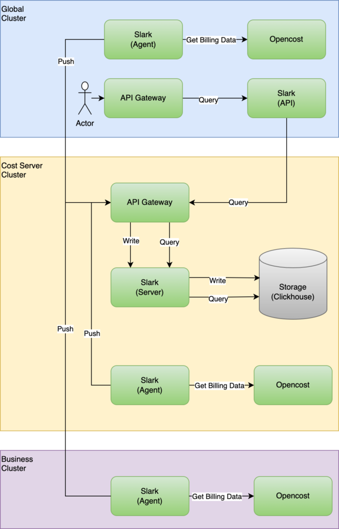

# Architecture

The platform provides overall metering and billing capabilities through the cooperation of **Alauda Container Platform Cost Management Server**, **Alauda Container Platform Cost Management Essentials** and **Alauda Container Platform Cost Management Agent** components:

- **Alauda Container Platform Cost Management Server**: You need to install this plugin in arbitrary cluster but only one in order to use the platform's metering and billing functions.

  - Interfaces with Clickhouse, responsible for receiving data reported by clients and storing it in the Clickhouse database, with no time limit on data storage.

  - Offers the ability to modify unit prices and currency unit configurations.

  - **Note**: The currency unit set by the platform currently only affects display purposes and does not support currency conversion between different units.

- **Alauda Container Platform Cost Management Essentials**: You need to install this plugin in the `global` cluster in order to use the platform's metering and billing UI and API functions.

  - Provides an API for querying metering and billing data.

  - Connects to **Alauda Container Platform Cost Management Server**, obtains the metering and billing data for UI.

- **Alauda Container Platform Cost Management Agent**: You need to install this plugin in the cluster where metering and billing are planned, so that the platform can meter and bill the resources in the cluster.

  - Interfaces with Prometheus, providing an exporter to store metering and billing metrics data in Prometheus.

  - Connects to **Alauda Container Platform Cost Management Server**, aggregates and calculates the metering and billing data for all resources in the cluster hourly, and reports it to the server. If the report fails, it will attempt to resend in next hour until successful.
