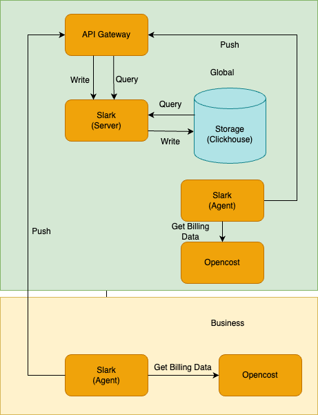

# 架构

平台通过 **ACP Cost Management Server** 和 **ACP Cost Management Agent** 插件配合提供平台整体的计量计费能力：

* **ACP Cost Management Server**：您需要在 global 集群安装该插件，方能使用平台的计量计费功能。

    * 对接 Clickhouse，负责接收客户端上报的数据，并将其存储至 Clickhouse 数据库中，数据存储暂无时间限制。

    * 提供 API，供页面查询计量计费数据。
    
    * 提供计费单价配置及货币单位配置的修改能力。

    * **注意** 平台设置的货币单位当前仅影响展示，并不支持货币单位之间的汇率换算。

* **ACP Cost Management Agent**：您需要在计划进行计量计费的集群安装该插件，平台方能对该集群中的资源进行计量计费。

    * 对接 Prometheus，提供 Exporter 向 Prometheus 内存储计量计费 Metrics 数据。

    * 对接 ACP Cost Management Server，每天凌晨零点半整体汇总计算集群内所有资源上一天的计量计费数据，并向服务端进行上报，失败后每隔两小时会再次上报直至成功。

